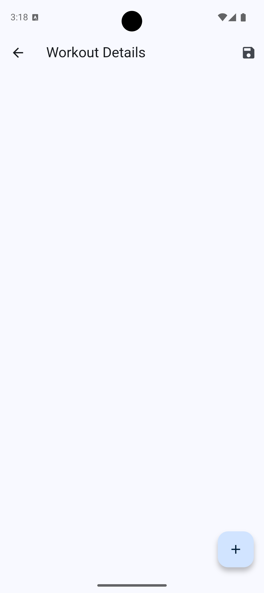
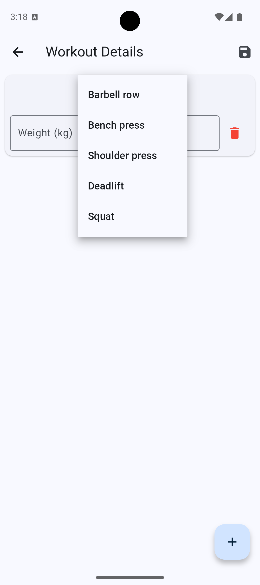
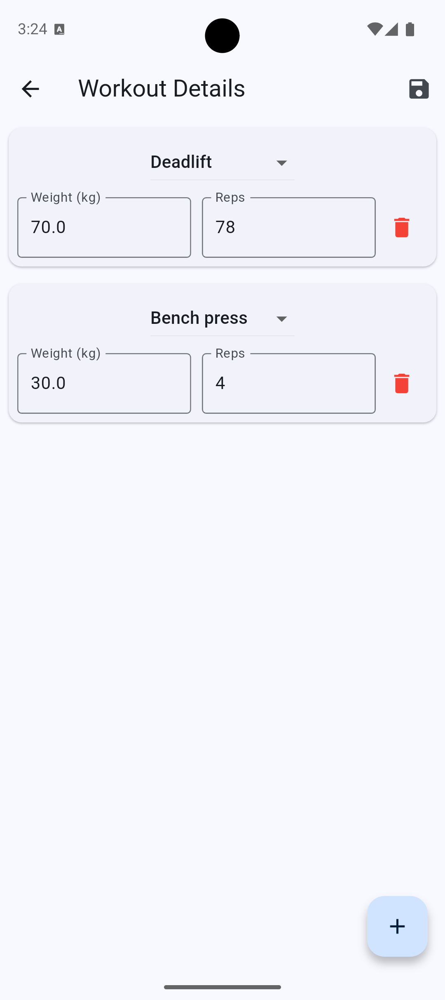
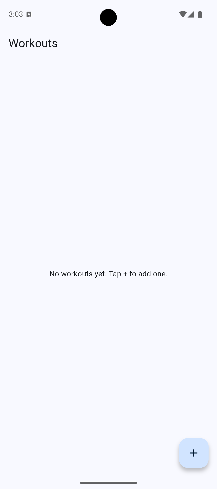
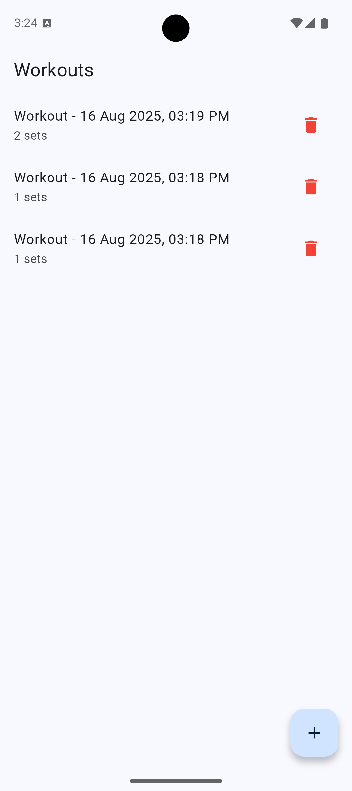

# magic_ai_workout_tracker

# Minimal Workout Tracker (Flutter)

A simple two-screen app that lets users **record workouts** (sets with exercise, weight, reps) and **view/manage** their saved workouts.

- **Workout Screen**: Add/edit sets (exercise from fixed list, weight, reps). Validation prevents empty/invalid saves.

### Workout Details

### Add Workout

### Manage Workouts

- **Workout List Screen**: See all workouts, sorted newest first, open to edit, or delete.

### Workout list initial

### Workout list updated

## Architecture

- **Presentation**: Flutter + Material widgets with small usability helpers (keys, simple inputs).
- **State Management**: **GetX**
  - Reasons: minimal boilerplate, reactive list updates, easy navigation/DI, great for small-to-mid apps.
- **Persistence**: **Hive**
  - Reasons: lightweight, fast NoSQL storage on device; strongly-typed with adapters; perfect for offline workout logs.
- **Data Model**:
  - `Workout` (id, date, sets)  
  - `WorkoutSet` (exercise, weight, reps)  
  - Hive adapters handle serialization, controller mediates reads/writes and sorts by date.

## Packages & Rationale

- **get**: Simple reactive state & routing. Keeps code small and readable.
- **hive / hive_flutter**: Local storage with adapters; no device DB setup required.
- **intl**: Human-friendly date formatting.
- **uuid**: Generates unique IDs for new workouts.

### Dev/Test Packages

- **flutter_test**: Unit & widget tests.
- **integration_test**: End-to-end flow on device/emulator.
- **hive_test**: In-memory Hive for fast, isolated tests.
- **build_runner & hive_generator**: Generate Hive type adapters.
- **mocktail** (optional): Stubbing/mocking if needed.

## Project Structure

lib/
main.dart
workout_model.dart
workout_controller.dart
workout_list_screen.dart
workout_screen.dart
test/
unit/
workout_controller_test.dart
widget/
workout_list_screen_test.dart
workout_screen_test.dart
integration_test/
app_test.dart
